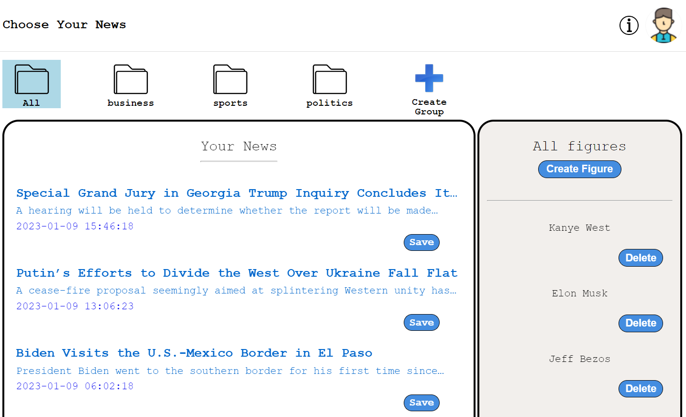
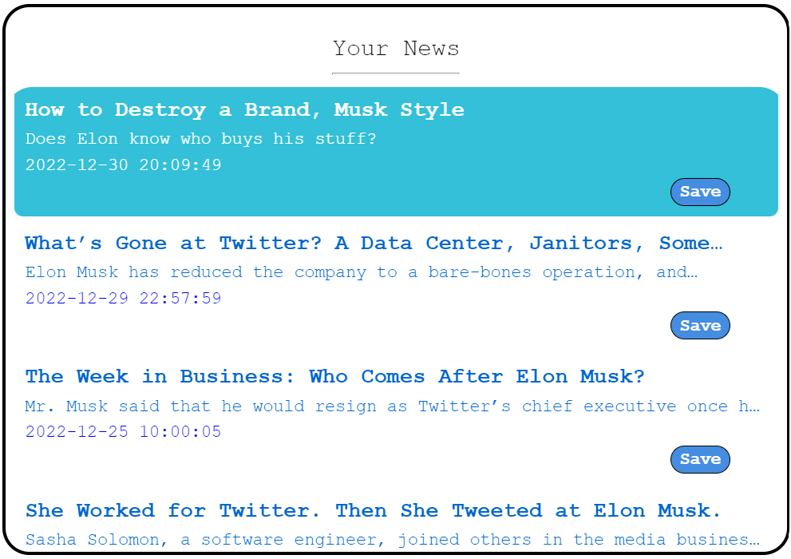
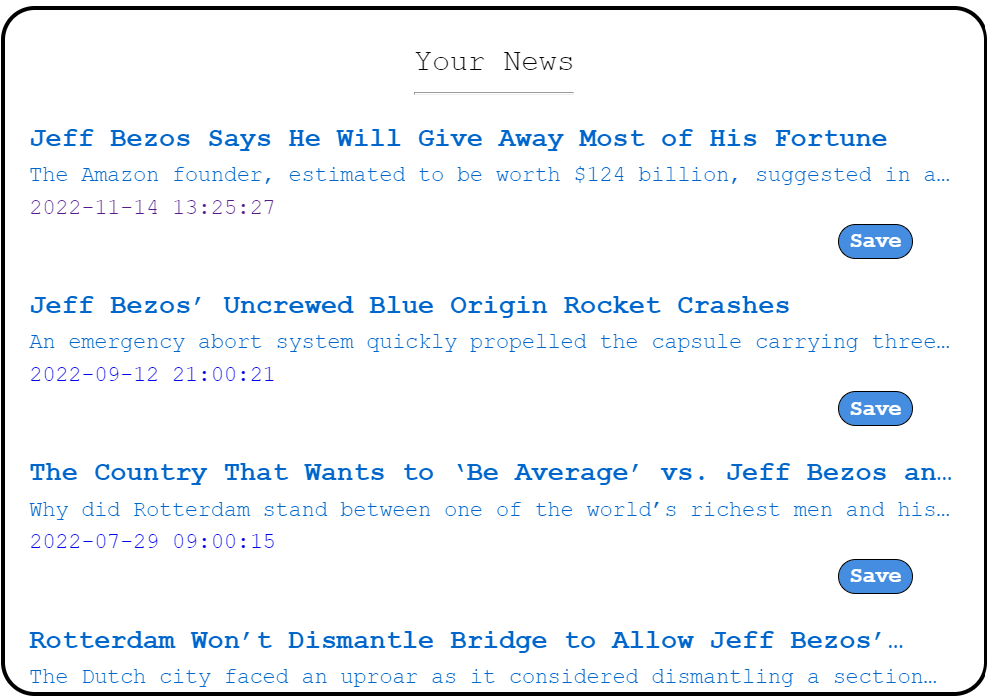
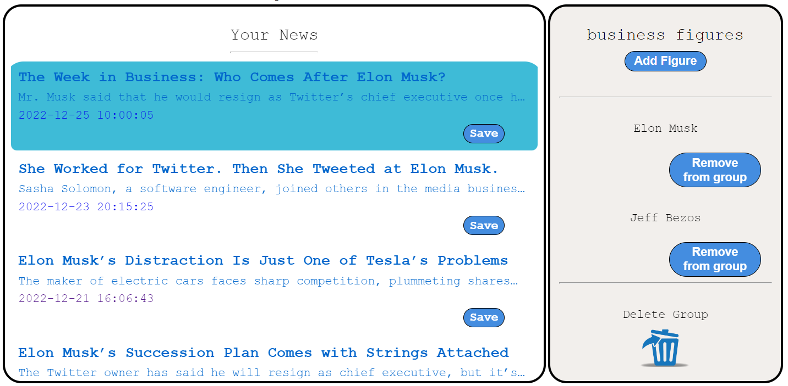
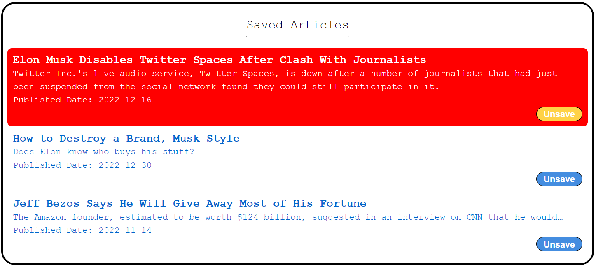

# MERN Project: Choose Your News


With so much news going on in the world all the time, it's impossible to keep up with all of it.  [Choose your news](https://choose-your-news.onrender.com/) is a news filtering service that lets you get news about specific figures you choose to follow. You can organize these figures into different groups based on topic, as well as save specific news articles and share your groups with other users.





## Technologies and libraries used:
- JavaScript
- MongoDB
- Express.js
- React/Redux
- Node.js
- NYT Articles API


## With Choose Your News, users can:

- #### See news pulled from the NY Times Articles API

News about followed figures is pulled live using the NYTimes API based on headlines and shown in a stream, similar to a social media newsfeed.  Pages show the most recent ten relevant articles that match *any* figure from the user's saved figures, organized from most to least recent.

```
const newyorktimesUrl = 'https://api.nytimes.com/svc/search/v2/articlesearch.json?';

    let filterQueryString = "";
    for (const key in filterQueryObj) {
        if (filterQueryObj.hasOwnProperty(key)) {
            filterQueryString += `fq=${key}:(${filterQueryObj[key]})&`
        }
    }
   
    const url = `${newyorktimesUrl}${filterQueryString}&sort=relevance&api-key=${newyorktimesApiKey}`;

    const response = await axios.get(url);
```



- #### Follow specific figures and get news about them




Users can choose which figures to follow, and their news feed is made up of news about these figures.  Users can filter to see only news about a specific figure they follow.


- #### Organize figures they follow into groups



Users can create groups to hold different figures they follow.  In addition to helping with organization, this lets users filter news to see only news about people in a given group.  (Altogether, there are three ways to view the news index: one for all figures they follow (on the home/index page), one for each group the follow, and one for each individual figure.)  Users can move figures into and out of groups.


- #### Save articles from their news feed



Users can bookmark interesting articles to their profiles, which will save these articles and allow the user to go back to them in the future.

```
    const savedArticles = useSelector(state => 
        state.articles.saved ? Object.values(state.articles.saved) : []);

    const dispatch = useDispatch();

    useEffect(() => {
        dispatch(fetchCurrentUserSavedArticles());
    }, [dispatch])
```


## Future Features:
- ~~Modify site to work on mobile also~~
- Search saved articles by figure
- Create new figures inside of group
- Pull articles from multiple APIs
